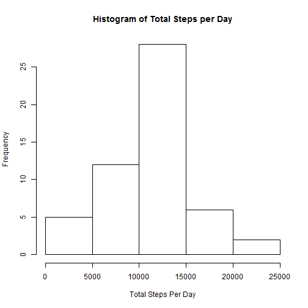

Resproducible Research Peer Assessment 1 
========================================================
**Loading and preprocessing the data**:
- Setup working directory
- Read the .csv file


```r
setwd("C:\\Users\\amanga1\\Downloads\\Reproducible Research\\wd")
data_act <- read.csv("activity.csv")
```

**What is mean total number of steps taken per day?**:
- Calculate the total steps per day
- Removed the NAs from var1
- Plotted the histogram of total steps per day.
- Calculate the mean and median of total steps per day


```r
totalsteps_pd <- aggregate(data_act$steps, by=list(data_act$date), FUN=sum)[2]
var1 <- totalsteps_pd[!is.na(totalsteps_pd)]
hist(as.numeric(var1),xlab="Total Steps Per Day", main="Histogram of Total Steps per Day")
```

 

```r
meansteps <- mean(as.numeric(var1))
mediansteps <- median(as.numeric(var1))
meansteps
```

```
## [1] 10766.19
```

```r
mediansteps
```

```
## [1] 10765
```

**What is the average daily activity pattern?**


```r
var2 <- aggregate(data_act$steps, list(data_act$interval), mean, na.rm=TRUE)
colnames(var2) <- c("interval", "steps")

plot(var2$interval, var2$steps, type = "l", xlab = "Interval", ylab = "Average no. of steps", main = "Average no. of steps taken daily in 5 minutes intervals")
```

 

```r
var3 <- var2[var2$steps == max(var2$steps),"interval"]
var3
```

```
## [1] 835
```
Thus 835th 5 minute interval had max number of steps averaged accross all days.

**Imputing missing values**


```r
var4 <- sum(is.na(data_act))
var4
```

```
## [1] 2304
```
Total number of missing values in the dataset = 2304

Creating a new data set with missing values replaced by mean of that 5-minute interval. Calculating mean and median and plotting histogram of the newdata set.


```r
newdata <- data_act
missingsteps <- which(is.na(newdata$steps))
for (i in 1:length(missingsteps)) {
    newdata[missingsteps[i],"steps"] <- var2[(var2$interval == newdata[missingsteps[i],"interval"]),"steps"]
}
newdata1 <- aggregate(newdata$steps, list(newdata$date), sum, na.rm=FALSE)

colnames(newdata1) <- c("date", "steps")

mean(newdata1$steps)
```

```
## [1] 10766.19
```

```r
median(newdata1$steps)
```

```
## [1] 10766.19
```

*The value of mean didn't change since we replaced missing value with mean of that 5 minute interval. If we had replaced missing values wih mean of that date then 2012-10-01 would have had value 0 changing the mean.*


```r
hist(newdata1$steps, main = "Histogram of Total Steps per Day (missing values replaced)", xlab = "Total Steps Per Day")
```

 

**Are there differences in activity patterns between weekdays and weekends?**

```r
day <- factor(c("weekday","weekend"))
newdata <- data.frame(day, newdata)

for (i in 1:nrow(newdata)) {
    if ((weekdays(as.Date(newdata[i,"date"])) == "Saturday") | (weekdays(as.Date(newdata[i,"date"])) == "Sunday")) {
        newdata[i,"day"] <- "weekend" }
    else {
        newdata[i,"day"] <- "weekday" } 
    }
library(lattice)
finaldata <- aggregate(newdata$steps, list(newdata$day, newdata$interval),mean)
colnames(finaldata) <- c("day", "interval", "steps")
xyplot(steps ~ interval | day, data = finaldata, type = "l", xlab = "Interval", ylab = "Total Number of Steps", layout = c(1,2))
```

 
*Conclusion: Person is more active in mornings on weekdays and evenly active on the weekends*
